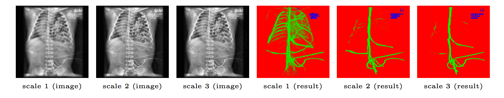

## Automatic catheter detection on pedeatric X-rays
This repo provides the trained model and testing code for catheter detection as described in our [paper](https://openreview.net/forum?id=By47mM_oG). 

Note that due to regulations on the patient data, we can not share the test dataset used in the paper. The test image provided in the dataset folder here was obtained by google image search with keyword "neonatal chest xray". The original image can be found [here](https://radiopaedia.org/play/11/entry/64/case/6351/studies/7717).  


## Prerequistites
- Linux
- Python 3.6
- NVIDIA GPU + CUDA CuDNN
- PyTorch v0.3

## Getting Started
### Installation
- Install PyTorch and dependencies from http://pytorch.org

- Install python libraries [visdom](https://github.com/facebookresearch/visdom) and [dominate](https://github.com/Knio/dominate).
```bash
pip install visdom
pip install dominate
```
- Clone this repo:
```bash
git clone https://github.com/xinario/catheter_detection
cd catheter_detection
```
- Download the synthetic x-rays from [here](https://1drv.ms/u/s!Aj4IQl4ug0_9hUSPHFV7SKa3ZJaX) (143M) and put the extracted folder into "./datasets/" folder. Note that this dataset has slightly more images than described in the paper, but won't affect too much about the result.

- Download the pretrained detection model from [here](https://1drv.ms/u/s!Aj4IQl4ug0_9hEsFwabtgd4bGgFp) (21M) and put it into the "./checkpoints/catheter_detect" folder

- Run the test script
```bash
python test.py --dataroot ./datasets/pediatric_internet/ --name catheter_detect  --phase test  --loadSize 480 --sourceoftest external
```

Now you can view the result by open the html file: results/catheter_detect/test_latest/index.html

- Or you can train a model from scratch which requires a GPU with at least 4G memory.
```bash
python train.py --dataroot ./datasets/synthetic_xray/ --name catheter_detect  --phase train --resize_or_crop none --loadSize 512   --output_nc 3  --which_model_netG srcnn --batchSize 1  --niter 50
```
### Citations
If you find it useful and are using the code/model provided here in a publication, please cite our paper.
```
@article{yi2018automatic,
  title={Automatic catheter detection in pediatric X-ray images using a scale-recurrent network and synthetic data},
  author={Yi, Xin and Adams, Scott and Babyn, Paul and Elnajmi, Abdul},
  journal={arXiv preprint arXiv:1806.00921},
  year={2018}
}
```


### Acknowlegements
[pix2pix](https://github.com/phillipi/pix2pix), [ConvLSTM_pytorch](https://github.com/ndrplz/ConvLSTM_pytorch)
